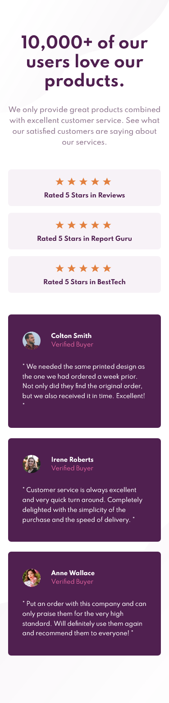
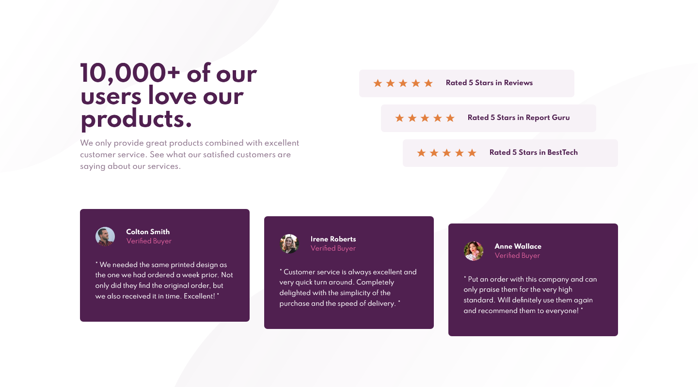

# Frontend Mentor - Social proof section solution

This is a solution to the [Social proof section challenge on Frontend Mentor](https://www.frontendmentor.io/challenges/social-proof-section-6e0qTv_bA). Frontend Mentor challenges help you improve your coding skills by building realistic projects. 

## Table of contents

- [Overview](#overview)
  
  - [The challenge](#the-challenge)
  - [Screenshot](#screenshot)
  - [Links](#links)
  
- [My process](#my-process)
  - [Built with](#built-with)
  
  

## Overview

### The challenge

Users should be able to:

- View the optimal layout for the section depending on their device's screen size

## Screenshot

### Mobile Solution (375px width)

### Desktop Solution (1440px width)

### Links

-  [Solution URL](https://github.com/AchrefFast/Frontend-Mentor--Social-proof-section-solution)
- [Live Site URL](https://achreffast.github.io/Frontend-Mentor--Social-proof-section-solution)

## My process

### Built with

- Semantic HTML5 markup

- SASS 

- SVGs

- CSS Grid

- Flexbox

  

## Author

- Frontend Mentor - [@AchrefFast](https://www.frontendmentor.io/profile/AchrefFast)
- GitHub - [@AchrefFast](https://github.com/AchrefFast)
